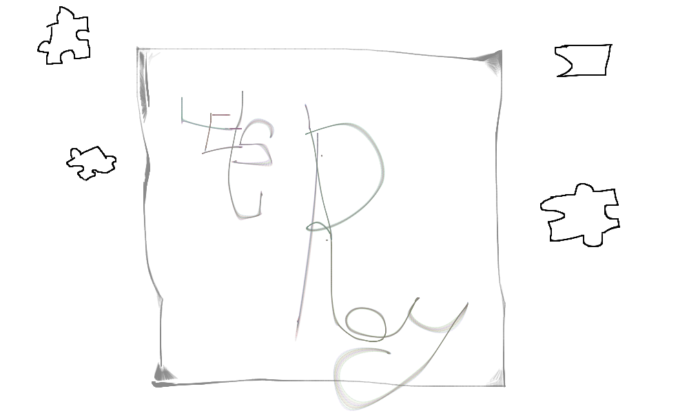
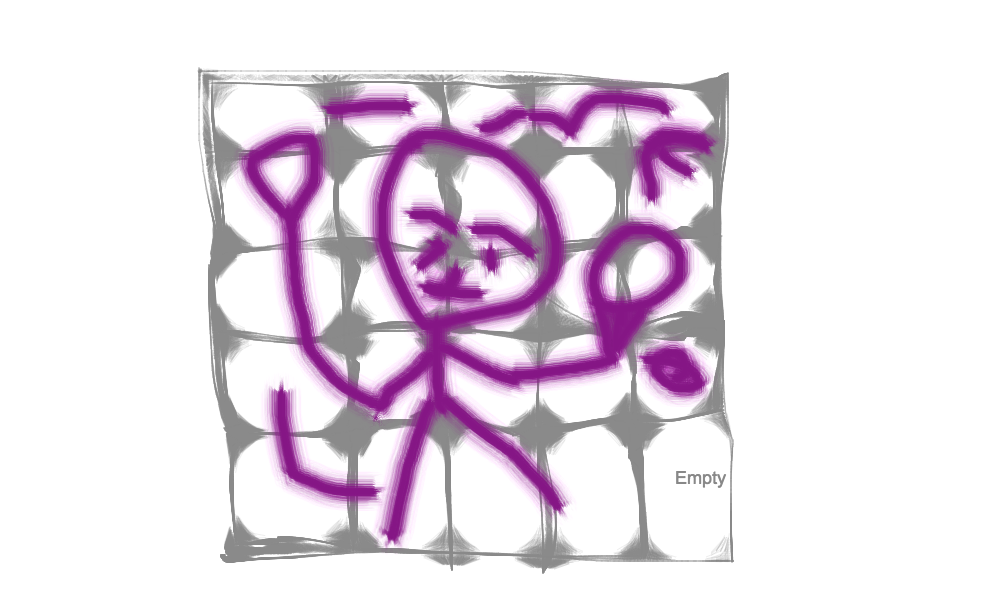
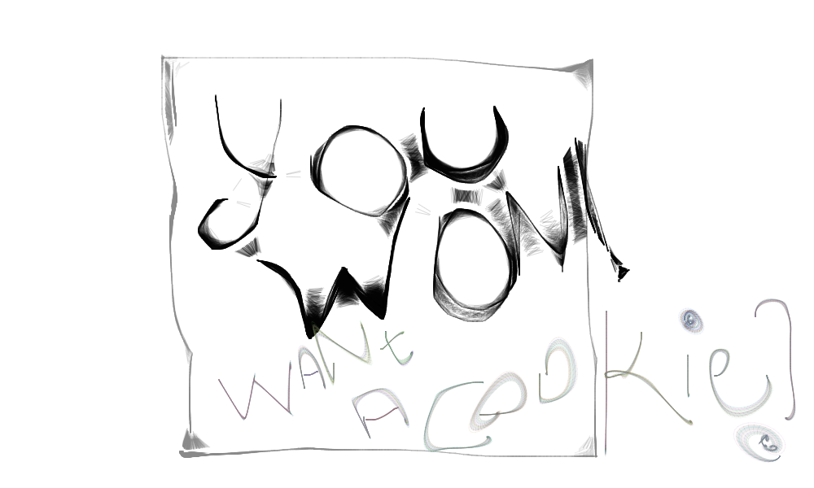

http://puzzleblocks.bitballoon.com/
-----------------------------------------
(was working here before uploaded to project 1 rep)https://git.generalassemb.ly/abubakar101/codepen_zdzPzN--2-
-------------------------------------------
Slides https://tinyurl.com/yb3vnmnu
---------------------------------
*** Muhammad Abubakar/Aug 08,2017 ***

# Puzzle Proposal

## What is Puzzle?

The puzzle game is where you get to align or solve small pieces and put them together to complete the whole numeral order.

## Wireframe

## Initial thoughts on game structure

- Creating a border of a puzzle
- Not Overlapping the each other pieces
- Assigning them the values to help with winning condition 

## Phases of Completion

### Phase I
- Assigning each square-divs a number and randomizing them...So when all the divs are put together, they resemble the whole numeral order.

### Pahse II
- Changing the innerHTML of whenever user decides to change the position of the block through replacing their innerHTML values
- User can select the innerHTML value for the intended number-block to move with first click only and and second click will change its value with first click.
- Second click only has to be white empty block.

### Phase III
- Giving them the winning conditions. If all the divs ID and their innerHTML match, there is a winner.
- The condition is checked for loop and it checks the IDs and their innerHTML.

### Phase IV
- Creating a Landing Page, Game Playing Page and Final winning Page
- (Landing Page) - has three buttons: "Play", "Instructions" and "About" 
- Working on CSS, i.e., contrast, color, animations. 
 -- giving the blocks/pieces, buttons a 3d touch
 -- Creating buttons for playing, instructions, about
 -- background Image
 -- and other small details!!

### Phase V 
- Giving it a final touch :)

## Links and Resources

(Coming Soon)
